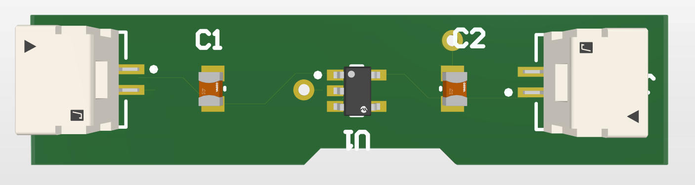

# PCB Power Convertor

**Designed by:** Jayaseelan  
**Tool:** Altium Designer  
**Date:** September 2026  

## About This Project
This is a PCB Power Convertor design made using Altium Designer.

## Components Used
- R1 - Resistor
- D1 - Diode
- J1, J2 - Connectors

## Schematic

## PCB Screenshot

## Files
| File | Description |
|------|-------------|
| Sheet1.SchDoc | Schematic Design |
| PCB_Power_convertor.PrjPcb | PCB Layout |
| CAMtastic1.Cam | CAM Output File |
